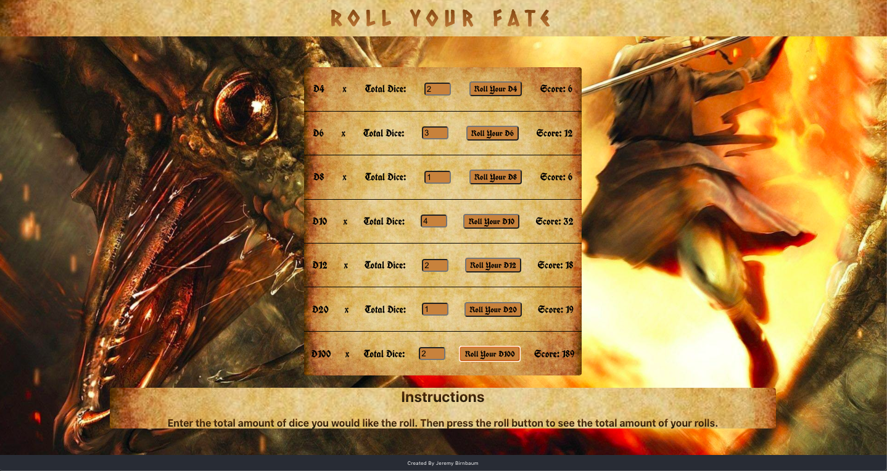

# Roll Your Fate

This is a basic dice rolling app. It allows you to roll any number of d4, d6, d8, d10, d12, d20, or d100.  

When you enter a number into the Total Dice field and click the roll button, the app generates a random number that the specific die would produce.  It will then add the total of the specified amount of rolls and display the total amount in the Score field.

## App Screenshot

## Dice Rolled Screenshot

This app was built using JavaScript, React, & CSS.